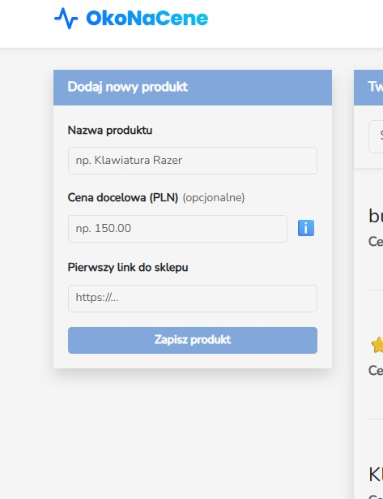
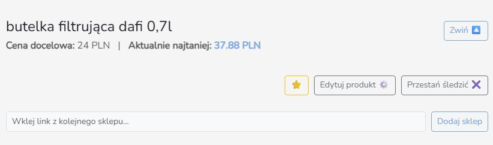
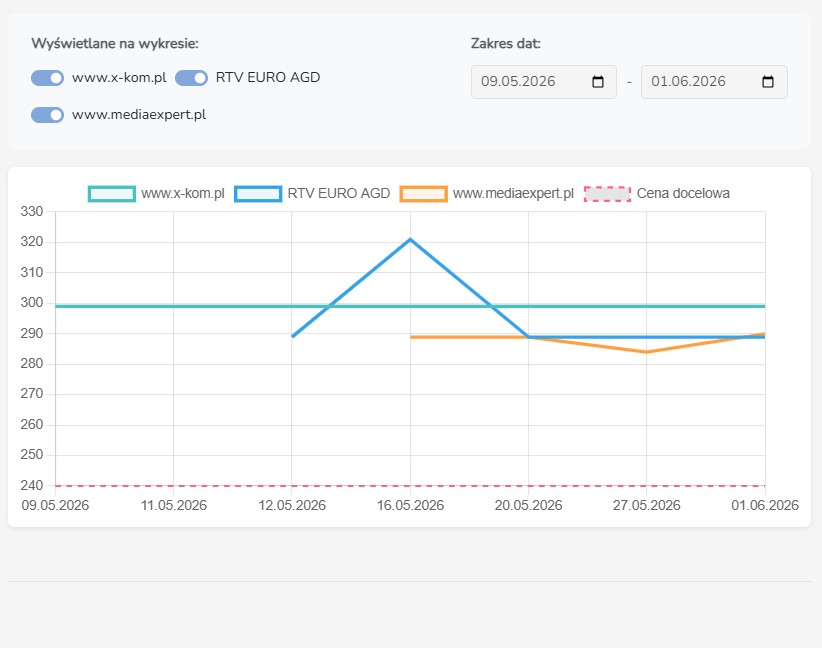

# Temat projektu

**OkoNaCene** to autorska, solowa aplikacja internetowa (stworzona przez Bartosza Buczulińskiego), której głównym zadaniem jest zautomatyzowanie procesu polowania na internetowe okazje. 

Aplikacja rozwiązuje problem ciągłego, męczącego i ręcznego sprawdzania cen pożądanych produktów. Użytkownik dodaje do systemu linki do interesującego go przedmiotu z różnych sklepów internetowych. Od tego momentu system każdego dnia, w pełni automatycznie, odpytuje sklepy i zapisuje aktualne kwoty, tworząc czytelny wykres wahań cen w czasie. Użytkownik może ustalić swoją wymarzoną "cenę docelową" od razu podczas dodawania produktu lub później, po przeanalizowaniu historycznego wykresu. Gdy cena w którymkolwiek ze sklepów spadnie poniżej ustalonego progu, aplikacja natychmiast wysyła powiadomienie.

---

## Uruchomienie projektu (developer)

Aplikacja została zbudowana w oparciu o najnowsze wersje narzędzi backendowych i frontendowych. Ze względu na wykorzystanie bazy SQLite, projekt jest wyjątkowo prosty w uruchomieniu lokalnym (nie wymaga stawiania osobnego serwera SQL).

| Technologia | Wersja | Link | Zastosowanie |
| :--- | :--- | :--- | :--- |
| **PHP** | `8.5` | [php.net](https://www.php.net/) | Główny język backendu |
| **Laravel** | `13.x` | [laravel.com](https://laravel.com/) | Framework aplikacji |
| **Node.js** | `24.x` | [nodejs.org](https://nodejs.org/) | Środowisko dla frontendu (Vite) |
| **SQLite** | `Wbudowane` | [sqlite.org](https://www.sqlite.org/) | Lekka relacyjna baza danych |
| **ScraperAPI** | `v1` | [scraperapi.com](https://www.scraperapi.com/) | API proxy do omijania blokad |

### Wymagania programowe

Do uruchomienia projektu w trybie deweloperskim potrzebujesz na swoim komputerze:
- **System operacyjny:** Windows (zalecany WSL2), macOS lub Linux.
- **Środowisko PHP:** zainstalowane PHP w wersji **8.5** wraz z rozszerzeniami (`sqlite3`, `curl`, `mbstring`).
- **Menedżer pakietów PHP:** `composer`.
- **Środowisko Node.js:** Node w wersji **24** oraz menedżer `npm`.

### Proces instalacji

1. **Pobranie projektu z repozytorium:**
```bash
   git clone https://github.com/Buczul/price-tracker.git
   cd price-tracker
```

2. **Instalacja zależności backendowych (PHP):**

```bash
   composer install
```

3. **Instalacja zależności frontendowych (JS/CSS):**

```bash
   npm install
```

### Proces konfiguracji

1. **Zmienne środowiskowe:**
    Utwórz plik .env na podstawie dostarczonego pliku .env.example (lub stwórz nowy plik .env) i wklej do niego poniższą konfigurację:

```
    APP_NAME=OkoNaCene
    APP_ENV=local
    APP_KEY=base64:BA3NBUEufCoOaQhHTcH2eUyfUXpObHITZJjMdK8L/MI=
    APP_DEBUG=true
    APP_URL=http://localhost
    APP_TIMEZONE='Europe/Warsaw'

    APP_LOCALE=pl
    APP_FALLBACK_LOCALE=pl
    APP_FAKER_LOCALE=pl_PL

    APP_MAINTENANCE_DRIVER=file
    # APP_MAINTENANCE_STORE=database

    # PHP_CLI_SERVER_WORKERS=4

    BCRYPT_ROUNDS=12

    LOG_CHANNEL=stack
    LOG_STACK=single
    LOG_DEPRECATIONS_CHANNEL=null
    LOG_LEVEL=debug

    DB_CONNECTION=sqlite
    # DB_HOST=127.0.0.1
    # DB_PORT=3306
    # DB_DATABASE=laravel
    # DB_USERNAME=root
    # DB_PASSWORD=

    SESSION_DRIVER=database
    SESSION_LIFETIME=120
    SESSION_ENCRYPT=false
    SESSION_PATH=/
    SESSION_DOMAIN=null

    BROADCAST_CONNECTION=log
    FILESYSTEM_DISK=local
    QUEUE_CONNECTION=database

    CACHE_STORE=database
    # CACHE_PREFIX=

    MEMCACHED_HOST=127.0.0.1

    REDIS_CLIENT=phpredis
    REDIS_HOST=127.0.0.1
    REDIS_PASSWORD=null
    REDIS_PORT=6379

    MAIL_MAILER=smtp
    MAIL_SCHEME=null
    MAIL_HOST=sandbox.smtp.mailtrap.io
    MAIL_PORT=2525
    MAIL_USERNAME=ce6d5b8f4c4bd6
    MAIL_PASSWORD=fd00b0855d3dff
    MAIL_FROM_ADDRESS="powiadomienia@okonacene.pl"
    MAIL_FROM_NAME="OkoNaCene"

    AWS_ACCESS_KEY_ID=
    AWS_SECRET_ACCESS_KEY=
    AWS_DEFAULT_REGION=us-east-1
    AWS_BUCKET=
    AWS_USE_PATH_STYLE_ENDPOINT=false

    VITE_APP_NAME="${APP_NAME}"

    SCRAPER_API_KEY=72d941ff307ccd5116a42c2280213d6e
```

2. **Baza danych:**

Ponieważ używany jest sqlite, wystarczy utworzyć pusty plik bazy w folderze bazy danych (często Laravel 13 robi to sam przy pierwszej migracji, ale w razie potrzeby wykonaj: touch database/database.sqlite).

3. **Migracje i dane początkowe:**

Zbuduj strukturę bazy danych i od razu zasil ją kontami testowymi poleceniem:

```bash
    php artisan migrate --seed
```
Konta testowe wygenerowane przez Seeder:

- **Konto zwykłego użytkownika:** Login: test@test.com | Hasło: test1234

- **Konto administratora:** Login: admintest@test.pl | Hasło: admintest1

3. **Uruchomienie projektu w terminalu:**

Aby aplikacja działała poprawnie (włączając w to frontend i zadania w tle), musisz otworzyć trzy osobne okna terminala w głównym folderze projektu i wpisać w nich odpowiednio:

Terminal 1 (Serwer HTTP Laravela):

```bash
    php artisan serve
```

Terminal 2 (Serwer deweloperski Vite dla frontendu):

```bash
    npm run dev
```

Terminal 3 (Proces nasłuchujący harmonogramu zadań – wykonuje skrypt sprawdzający ceny):

```bash
    php artisan schedule:work
```
Aplikacja będzie dostępna w przeglądarce pod adresem: http://localhost:8000.

## Uruchomienie projektu (user)

Aplikacja w tej chwili nie jest opublikowana w sieci na żadnej domenie.
Jeżeli został uruchomiony server lokalny z aplikacją, będzie ona dostępna pod adresem http://localhost:8000.
Do płynnego działania wystarczy dowolna przeglądarka internetowa (np. Chrome).

## Podręcznik użytkownika

W systemie istnieją tylko dwie role: User (zwykły użytkownik śledzący ceny) oraz Admin (osoba nadzorująca bazę danych).

1. **Dodawanie produktu i ustalanie ceny docelowej**

Kluczowym miejscem aplikacji jest główny panel użytkownika. Z poziomu lewej kolumny użytkownik określa nazwę pożądanego produktu oraz wkleja link do sklepu. Użytkownik ma pełną swobodę – może podać cenę docelową od razu, by natychmiast uaktywnić powiadomienia, lub zostawić pole puste i uzupełnić je później po zebraniu danych. 

*Formularz dodawania produktu*


Po dodaniu produktu użytkownik może dodać kolejne linki z innych sklepów, aby możliwe było śledzenie cen z różnych stron. W dowolnym momencie użytkownik może przestać śledzić produkt, zmieniać cenę docelową, dodawać lub przestawać śledzić sklepy lub edytować ich etykiety oraz linki w razie błędu. Zablokowana została możliwość wpisywania tekstu w polu docelowej ceny, aby dodatkowo uchronić system przed błędami.

*Formularz dodawania kolejnego sklepu do produktu*


2. **Analiza wykresów cenowych**

Każdy dodany produkt generuje interaktywny wykres liniowy. Aplikacja gromadzi dane o cenach i układa je na osi czasu. Wykres wizualizuje historyczne trendy. Jeśli użytkownik zauważy, że dany towar ma tendencję do spadków np. w połowie miesiąca, może świadomie ustawić swoją docelową kwotę pod przyszły spadek. Użytkownik ma również możliwość włączania lub wyłączania danych sklepów lub danych historycznych na wykresie.

*Wykres produktu*


Historyczne ceny to nic innego jak dane o produkcie pobrane od innych użytkowników, którzy śledzili go wcześniej. Aplikacja sprawdza czy dany linki były już w bazie i wyświetla ich najniższy poziom dla danej daty.

*Wykres produktu, inni użytkownicy śledzili już ten produkt w dniu 20.05.2026 co zostało ujęte na wykresie*


W celu ułatwienia dostępu do potrzebnych produktów, użytkownik ma możliwość filtorwania oraz wyszukiwania produktów dzięki użyciu zmodyfikowanych zapytań SQL, a także ich sortowania przy pomocy sortowania wczytanch już kolekcji. Dodatowo zaimpelentowana została funkcja dodawnia produktów do ulubionych, w celu łatwego dostępu do nich w wygodnym panelu po prawej stonie ekranu.

*Panel główny z opcjami sortowania, filtrowania i wyszukiwania oraz okienko z ulubionymi produktami*


3. **Automatyzacja (Bot zbierający ceny)**

Proces pozyskiwania cen jest dla użytkownika całkowicie "przezroczysty". Pod spodem działa zautomatyzowany skrypt korzystający ze ScraperAPI (omijający zabezpieczenia sklepów internetowych). Codziennie o określonej godzinie w nocy system pobiera ceny dla wszystkich przypiętych linków i weryfikuje je z cenami docelowymi.

4. **Rola Administratora (Zarządzanie systemem)**

Osoba z uprawnieniami administratora ma w menu widoczną dodatkową zakładkę do obsługi bazy. Z tego poziomu administrator widzi wszystkie rekordy ze wszystkich tabel (produkty, linki, użytkownicy) i posiada pełne uprawnienia CRUD (Create, Read, Update, Delete) do reagowania na potencjalne błędy i zarządzania środowiskiem.

## Plany rozbudowy

Aplikacja OkoNaCene posiada stabilną architekturę i zrealizowane kluczowe cele biznesowe, jednak w wersji v2.0 zaplanowano implementację kolejnych funkcji:

- **Rola "Guest" (Gość):** Wprowadzenie nowej roli, pozwalającej nieozalogowanym osobom na wgląd do publicznych wykresów. Będą oni mogli jedynie przeglądać statystyki dodane przez społeczność, bez uprawnień do edycji czy dodawania własnych linków.

- **Globalny eksplorator produktów:** Stworzenie globalnej listy produktów dodanych przez wszystkich użytkowników (z zachowaniem anonimowości, kto je dodał). Użytkownicy mogliby przeglądać najpopularniejsze okazje w systemie i podpinać je do własnego profilu jednym kliknięciem.

- **Optymalizacja bota scrapującego:** Przebudowa mechanizmu kolejkowania zapytań do ScraperAPI. Usprawnienie caching'u – jeżeli wielu użytkowników w systemie śledzi ten sam link w tym samym sklepie, bot powinien wysyłać tylko jedno odpytanie zliczając zaktualizowaną cenę zbiorczo dla wszystkich zapytań w bazie, drastycznie zmniejszając koszty zapytań do zewnętrznego API.